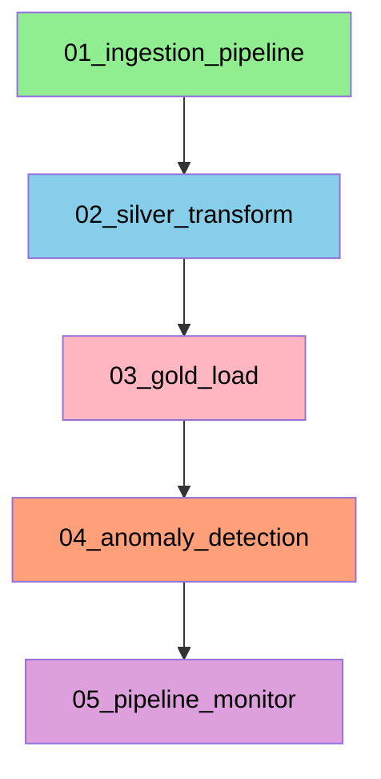

# ☀️ Solar Energy Data Pipeline

[](https://www.python.org/)
[](https://kafka.apache.org/)
[](https://www.postgresql.org/)
[](https://airflow.apache.org/)
[](https://www.docker.com/)
[](LICENSE)

## 📋 Project Overview

A complete end-to-end data pipeline for solar panel monitoring, implementing the **medallion architecture** (Bronze, Silver, Gold layers). The project simulates IoT solar panel data, streams it through Kafka, stores it in PostgreSQL, and transforms it through multiple refinement layers for business intelligence and analytics.

### 🎯 Key Features

- **Real-time IoT Simulation**: Python producer generating realistic solar panel data for 10 panels
- **Weather Data Integration**: WeatherStack API integration for environmental context
- **Streaming Pipeline**: Apache Kafka for message brokering (port 9093)
- **Medallion Architecture**: Bronze (raw), Silver (cleaned), Gold (aggregated) layers
- **Data Quality Framework**: Validation rules, quality flags, anomaly detection
- **Pipeline Orchestration**: Apache Airflow DAGs for scheduling
- **Comprehensive Monitoring**: Health checks, data freshness, quality metrics
- **Fully Containerized**: Easy deployment with Docker Compose

---

## 📊 Feasibility Analysis

Comprehensive feasibility analysis for the installation of photovoltaic panels in Turin. The project processes real meteorological data to calculate potential energy production, evaluates different self-consumption strategies (20–70%), and provides a detailed economic analysis including ROI, payback period, and profit over 20–25 years.

---

## 🏗️ Architecture

```
┌─────────────────────────────────────────────────────────────────────┐
│                        DATA SOURCES                                  │
└─────────────────────────────────────────────────────────────────────┘
                              │
            ┌─────────────────┴─────────────────┐
            ▼                                   ▼
┌───────────────────────┐             ┌───────────────────────┐
│   WEATHERSTACK API    │             │   IOT SIMULATOR       │
│   (weatherstack.com)  │             │   (Kafka Producer)    │
└───────────┬───────────┘             └───────────┬───────────┘
            │                                     │
            ▼                                     ▼
    ┌───────────────┐                     ┌───────────────┐
    │  Python Fetch │                     │    Kafka      │
    │   (hourly)    │                     │  (solar-raw)  │
    └───────┬───────┘                     └───────┬───────┘
            │                                     │
            └──────────────┬──────────────────────┘
                           ▼
              ┌─────────────────────────┐
              │     PostgreSQL          │
              │     (solar_data)        │
              └─────────────┬───────────┘
                            │
            ┌───────────────┴───────────────┐
            ▼                               ▼
    ┌───────────────┐               ┌───────────────┐
    │  weather_data │               │solar_panel_   │
    │   (Bronze)    │               │  readings     │
    └───────┬───────┘               └───────┬───────┘
            │                               │
            └───────────────┬───────────────┘
                            ▼
              ┌─────────────────────────┐
              │     Silver Layer        │
              │  (Cleaned & Enriched)   │
              │ - silver_weather        │
              │ - silver_solar          │
              └─────────────┬───────────┘
                            │
                            ▼
              ┌─────────────────────────┐
              │     Gold Layer          │
              │   (Aggregated Data)     │
              │ - gold_daily_panel      │
              │ - gold_hourly_system    │
              │ - gold_monthly_kpis     │
              │ - gold_anomalies        │
              └─────────────┬───────────┘
                            │
            ┌───────────────┴───────────────┐
            ▼                               ▼
    ┌───────────────┐               ┌───────────────┐
    │   Monitoring  │               │   Apache      │
    │   & Alerts    │               │   Airflow     │
    └───────────────┘               └───────────────┘
```

---

## 📁 Project Structure

```
Energy-Trading-Pipeline/
│
├── 📁 config/                          # Configuration files
│   └── userdata_config.py               # Central configuration
│
├── 📁 ingestion/                        # Data ingestion
│   ├── 📁 api/                          # Weather API
│   │   └── weatherstack_fetcher.py      # WeatherStack API client
│   ├── 📁 iot/                          # IoT simulation
│   │   ├── solar_producer.py            # Kafka producer
│   │   └── iot_to_postgres.py           # Kafka consumer
│   └── 📁 scripts/                       # Utility scripts
│       └── create-topics.sh              # Kafka topic setup
│
├── 📁 postgres/                          # Database scripts
│   ├── 📁 init/                          # Initialization
│   │   └── init.sql                       # Database schema
│   ├── 📁 bronze/                         # Bronze layer
│   │   ├── ddl_bronze.sql
│   │   └── data_verify.sql
│   ├── 📁 silver/                         # Silver layer
│   │   ├── ddl_silver.sql
│   │   ├── silver_load.sql
│   │   └── data_verify.sql
│   └── 📁 gold/                           # Gold layer
│       ├── ddl_gold.sql
│       ├── gold_load_daily.sql
│       ├── gold_load_hourly.sql
│       ├── gold_load_monthly.sql
│       ├── gold_load_anomalies.sql
│       └── data_verify.sql
│
├── 📁 orchestration/                      # Airflow orchestration
│   ├── 📁 dags/                           # DAG definitions
│   │   ├── 01_ingestion_dag.py
│   │   ├── 02_silver_transform_dag.py
│   │   ├── 03_gold_load_dag.py
│   │   ├── 04_anomaly_detection_dag.py
│   │   └── 05_pipeline_monitor_dag.py
│   └── 📁 scripts/                         # Utility scripts
│       ├── check_kafka.py
│       ├── check_postgres.py
│       └── alert.py
│
├── 📁 monitoring/                          # Monitoring & alerts
│   ├── health_checks.sql
│   └── 📁 alerts/
│       └── anomaly_alerts.py
│
├── 📁 docs/                                # Documentation
│   ├── architecture.md
│   ├── data_dictionary.md
│   └── setup_guide.md
│
├── 🐳 docker-compose.yml                    # Docker services
├── 📝 requirements.txt                      # Python dependencies
└── 📚 README.md                              # This file
```

---

## 🚀 Quick Start

### Prerequisites

- Docker Desktop 20.10+
- Python 3.8+
- 8GB RAM minimum
- WeatherStack API key (free at [weatherstack.com](https://weatherstack.com))

### Installation

```bash
# 1. Clone the repository
git clone https://github.com/yourusername/Energy-Trading-Pipeline.git
cd Energy-Trading-Pipeline

# 2. Set up Python environment
python -m venv .venv
source .venv/bin/activate  # On Windows: .venv\Scripts\activate
pip install -r requirements.txt

# 3. Configure API key
# Edit config/userdata_config.py and add your WeatherStack API key

# 4. Start Docker services
docker-compose up -d
sleep 30  # Wait for services to initialize

# 5. Create Kafka topics
chmod +x ingestion/scripts/create-topics.sh
./ingestion/scripts/create-topics.sh

# 6. Initialize database
docker cp postgres/init/init.sql postgres:/tmp/
docker exec -it postgres psql -U airflow -d postgres -c "CREATE DATABASE solar_data;"
docker exec -it postgres psql -U airflow -d solar_data -f /tmp/init.sql

# 7. Start the pipeline
# Terminal 1: IoT Producer
python ingestion/iot/solar_producer.py

# Terminal 2: IoT Consumer
python ingestion/iot/iot_to_postgres.py

# Terminal 3: Weather Fetcher
python ingestion/api/weatherstack_fetcher.py --city Turin --continuous
```

---

## 📊 Data Flow

### 1. **Ingestion**
- **Weather Data**: WeatherStack API → Python fetcher → `weather_data` table
- **IoT Data**: Python producer → Kafka (`solar-raw`) → Consumer → `solar_panel_readings` table

### 2. **Medallion Transformations**

| Layer | Tables | Description |
|-------|--------|-------------|
| **Bronze** | `weather_data`, `solar_panel_readings` | Raw data as received |
| **Silver** | `silver_weather`, `silver_solar` | Cleaned, enriched with categories and quality flags |
| **Gold** | `gold_daily_panel`, `gold_hourly_system`, `gold_monthly_kpis`, `gold_anomalies` | Aggregated business metrics |

---

## 🔧 Configuration

### API Configuration (`config/userdata_config.py`)

```python
API_CONFIG = {
    'weatherstack': {
        'base_url': 'http://api.weatherstack.com',
        'access_key': 'your-api-key-here',  # Required
    }
}

POSTGRES_CONFIG = {
    'host': 'localhost',
    'port': 5432,
    'database': 'solar_data',
    'user': 'airflow',
    'password': 'airflow'
}

PANEL_PARAMS = {
    'panel_power_kw': 3.0,
    'panel_efficiency': 0.19,
    'system_losses': 0.14,
    'temp_loss_coeff': 0.004,
    'panel_type': 'Monocrystalline'
}
```

---

## 🎯 Airflow Orchestration

### DAG Dependencies



| DAG | Schedule | Description |
|-----|----------|-------------|
| `01_ingestion_pipeline` | Every 15 min | Fetch weather and ensure Kafka ingestion |
| `02_silver_transform` | Hourly | Transform Bronze → Silver |
| `03_gold_load` | Daily | Load Gold aggregations |
| `04_anomaly_detection` | Hourly | Detect and alert on anomalies |
| `05_pipeline_monitor` | Hourly | Overall pipeline health monitoring |

---

## 📊 Monitoring

### Health Checks

```bash
# Run comprehensive health checks
cd monitoring
./run_health_checks.sh

# Check anomaly alerts
python3 alerts/anomaly_alerts.py

# Force test alert
python3 alerts/anomaly_alerts.py --force
```

### Health Score Calculation

The pipeline monitor calculates a health score (0-100) based on:
- **Data Freshness** (30 points)
- **Active Anomalies** (40 points)
- **Data Quality** (30 points)

---

## 🔌 Service Ports

| Service | URL | Credentials |
|---------|-----|-------------|
| Airflow | http://localhost:8080 | admin / admin |
| Kafka-UI | http://localhost:8081 | - |
| pgAdmin | http://localhost:5050 | admin@msr.com / admin |
| Metabase | http://localhost:3000 | Create account |
| PostgreSQL | `localhost:5432` | airflow / airflow |

---

## 📈 Sample Queries

### Bronze Layer
```sql
-- Latest weather data
SELECT * FROM weather_data ORDER BY timestamp DESC LIMIT 5;

-- Latest solar readings
SELECT * FROM solar_panel_readings ORDER BY timestamp DESC LIMIT 5;
```

### Silver Layer
```sql
-- Valid solar readings with performance categories
SELECT timestamp, panel_id, production_kw, performance_category
FROM silver_solar
WHERE is_valid = true
ORDER BY timestamp DESC
LIMIT 10;
```

### Gold Layer
```sql
-- Daily panel performance
SELECT date, panel_id, total_production_kwh, avg_efficiency
FROM gold_daily_panel
WHERE date = CURRENT_DATE
ORDER BY total_production_kwh DESC;

-- Active anomalies
SELECT anomaly_type, severity, COUNT(*)
FROM gold_anomalies
WHERE resolution_status = 'Open'
GROUP BY anomaly_type, severity;
```

---

## 🐛 Troubleshooting

### Common Issues

| Issue | Solution |
|-------|----------|
| Kafka connection refused | `docker-compose restart kafka` |
| PostgreSQL connection failed | `docker-compose restart postgres` |
| Airflow DAGs not showing | Check `docker exec -it airflow ls -la /opt/airflow/dags/` |
| Weather API rate limited | Wait or upgrade at weatherstack.com |
| No data in gold tables | Run silver transform first: `02_silver_transform` |

### Reset Everything

```bash
# Stop and remove all containers
docker-compose down -v

# Start fresh
docker-compose up -d
```

---

## 📚 Documentation

- [Architecture Overview](docs/architecture.md)
- [Data Dictionary](docs/data_dictionary.md)
- [Setup Guide](docs/setup_guide.md)

---

## 🛠️ Technologies Used

| Category | Technologies |
|----------|--------------|
| **Languages** | Python 3.8+, SQL |
| **Streaming** | Apache Kafka 4.0.1, Kafka-UI |
| **Database** | PostgreSQL 15 |
| **Orchestration** | Apache Airflow 2.7.1 |
| **Containerization** | Docker, Docker Compose |
| **Monitoring** | Custom Python scripts, SQL |
| **Visualization** | Metabase, pgAdmin |

---

## 🤝 Contributing

1. Fork the repository
2. Create your feature branch (`git checkout -b feature/AmazingFeature`)
3. Commit your changes (`git commit -m 'Add some AmazingFeature'`)
4. Push to the branch (`git push origin feature/AmazingFeature`)
5. Open a Pull Request

---

## 📄 License

This project is licensed under the MIT License - see the [LICENSE](LICENSE) file for details.

---

## 👥 Authors

- **Matheus Sabaudo Rodrigues** - *Data Engineer* - [YourGitHub](https://github.com/MatheusSabaudo)

---

## 🙏 Acknowledgments

- WeatherStack API for weather data
- Apache Kafka and Airflow communities
- PostgreSQL team

---

## 📊 Project Status

✅ **Complete** - Production-ready pipeline with:
- Data ingestion from multiple sources
- Medallion architecture implementation
- Airflow orchestration
- Comprehensive monitoring
- Full documentation

---

**Built with** ❤️ for solar energy monitoring and data engineering excellence

**Version**: 2.0.0 | **Last Updated**: February 2026
