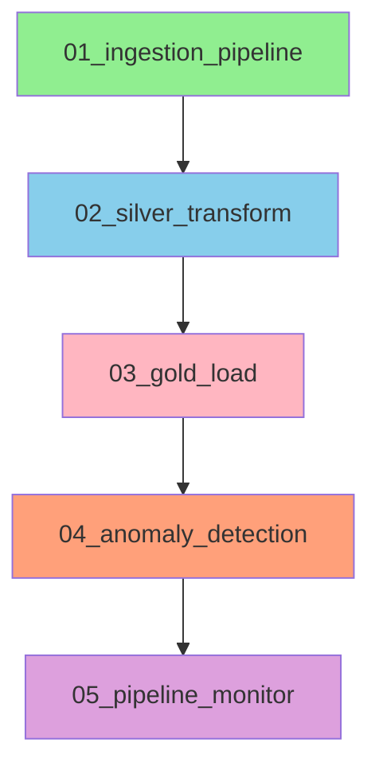

## 📄 **`docs/architecture.md`**

```markdown
# Solar Pipeline Architecture

## 🏗️ System Overview

The Solar Pipeline is a complete data engineering solution that ingests weather data from WeatherStack API and simulated IoT solar panel data through Kafka, processes it through a medallion architecture (Bronze, Silver, Gold layers), and provides monitoring and alerting capabilities.

## 📊 Architecture Diagram

```
┌─────────────────────────────────────────────────────────────────────┐
│                        DATA SOURCES                                  │
└─────────────────────────────────────────────────────────────────────┘
                              │
            ┌─────────────────┴─────────────────┐
            ▼                                   ▼
┌───────────────────────┐             ┌───────────────────────┐
│   WEATHERSTACK API    │             │   IOT SIMULATOR       │
│   (weatherstack.com)  │             │   (Kafka Producer)    │
└───────────┬───────────┘             └───────────┬───────────┘
            │                                     │
            ▼                                     ▼
    ┌───────────────┐                     ┌───────────────┐
    │  Python Fetch │                     │    Kafka      │
    │   (hourly)    │                     │  (solar-raw)  │
    └───────┬───────┘                     └───────┬───────┘
            │                                     │
            └──────────────┬──────────────────────┘
                           ▼
              ┌─────────────────────────┐
              │     PostgreSQL          │
              │     (solar_data)        │
              └─────────────┬───────────┘
                            │
            ┌───────────────┴───────────────┐
            ▼                               ▼
    ┌───────────────┐               ┌───────────────┐
    │  weather_data │               │solar_panel_   │
    │   (Bronze)    │               │  readings     │
    └───────┬───────┘               └───────┬───────┘
            │                               │
            └───────────────┬───────────────┘
                            ▼
              ┌─────────────────────────┐
              │     Silver Layer        │
              │  (Cleaned & Enriched)   │
              │ - silver_weather        │
              │ - silver_solar          │
              └─────────────┬───────────┘
                            │
                            ▼
              ┌─────────────────────────┐
              │     Gold Layer          │
              │   (Aggregated Data)     │
              │ - gold_daily_panel      │
              │ - gold_hourly_system    │
              │ - gold_monthly_kpis     │
              │ - gold_anomalies        │
              └─────────────┬───────────┘
                            │
            ┌───────────────┴───────────────┐
            ▼                               ▼
    ┌───────────────┐               ┌───────────────┐
    │   Monitoring  │               │   Apache      │
    │   & Alerts    │               │   Airflow     │
    └───────────────┘               └───────────────┘
```

## 🏛️ Architecture Layers

### 1. **Ingestion Layer**
- **Weather Data**: Python script fetching from WeatherStack API (every 15 minutes)
- **IoT Data**: Kafka producer simulating 10 solar panels with realistic production patterns
- **Message Broker**: Apache Kafka (port 9093 external, 9092 internal)

### 2. **Storage Layer (PostgreSQL)**
- **Database**: `solar_data`
- **Connection**: `postgres:5432` (internal), `localhost:5432` (external)
- **User**: `airflow` with password `airflow`

### 3. **Medallion Architecture**

#### Bronze Layer (Raw Data)
| Table | Description |
|-------|-------------|
| `weather_data` | Raw weather data from WeatherStack API |
| `solar_panel_readings` | Raw IoT solar panel data from Kafka |

#### Silver Layer (Cleaned & Enriched)
| Table | Description |
|-------|-------------|
| `silver_weather` | Weather data with date parts, categories, quality flags |
| `silver_solar` | Solar data with efficiency ratios, performance categories |

#### Gold Layer (Aggregated)
| Table | Description |
|-------|-------------|
| `gold_daily_panel` | Daily performance per panel |
| `gold_hourly_system` | Hourly system-wide metrics |
| `gold_monthly_kpis` | Monthly KPIs for business reporting |
| `gold_anomalies` | Detected anomalies with severity levels |

### 4. **Orchestration Layer (Apache Airflow)**
- **DAGs**:
  - `01_ingestion_pipeline`: Runs every 15 minutes
  - `02_silver_transform`: Runs hourly
  - `03_gold_load`: Runs daily
  - `04_anomaly_detection`: Runs hourly
  - `05_pipeline_monitor`: Runs hourly

### 5. **Monitoring Layer**
- **Health Checks**: SQL-based system health verification
- **Anomaly Alerts**: Console-based alerting for critical issues
- **Pipeline Monitor**: Overall health scoring (0-100)

## 🔧 Technology Stack

| Component | Technology | Version |
|-----------|------------|---------|
| Database | PostgreSQL | 15 |
| Message Broker | Apache Kafka | 4.0.1 |
| Orchestration | Apache Airflow | 2.7.1 |
| Programming | Python | 3.8+ |
| Container | Docker | Latest |
| Kafka UI | Kafbat UI | Latest |
| DB Management | pgAdmin | Latest |
| Visualization | Metabase | Latest |

## 🔌 Port Mapping

| Service | Internal Port | External Port | URL |
|---------|---------------|---------------|-----|
| PostgreSQL | 5432 | 5432 | `localhost:5432` |
| Kafka | 9092 (internal) | 9093 | `localhost:9093` |
| Kafka-UI | 8080 | 8081 | http://localhost:8081 |
| Airflow | 8080 | 8080 | http://localhost:8080 |
| pgAdmin | 80 | 5050 | http://localhost:5050 |
| Metabase | 3000 | 3000 | http://localhost:3000 |

## 📊 Data Flow

1. **Weather Data**: WeatherStack API → Python fetcher → PostgreSQL (`weather_data`)
2. **IoT Data**: Python producer → Kafka (`solar-raw`) → Consumer → PostgreSQL (`solar_panel_readings`)
3. **Silver Transform**: Bronze tables → SQL transformations → Silver tables
4. **Gold Aggregations**: Silver tables → Aggregations → Gold tables
5. **Monitoring**: Gold tables → Health checks → Alerts

## 🔄 DAG Dependencies



## 🔐 Security

- All services run in Docker with internal networking
- Database credentials stored in configuration
- Airflow connections managed via UI/CLI
- No sensitive data exposed externally
- Environment variables for API keys

## 📈 Scalability

- Kafka partitions: 3 (configurable)
- PostgreSQL indexing on timestamp and panel_id
- Airflow distributed executor ready
- Modular design for adding new data sources
- Horizontal scaling possible for Kafka consumers

## 🏥 Health Monitoring

- **Data Freshness**: Checks if data is arriving on time
- **Anomaly Detection**: Flags unusual patterns
- **Quality Metrics**: Tracks data quality percentages
- **Pipeline Lag**: Monitors Bronze → Silver → Gold latency
- **Health Score**: Overall system health (0-100)

## 📁 Project Structure

```
Energy-Trading-Pipeline/
├── 📁 config/                 # Configuration files
├── 📁 ingestion/              # Data ingestion scripts
│   ├── 📁 api/                # Weather API fetcher
│   └── 📁 iot/                # Kafka producer/consumer
├── 📁 postgres/               # Database scripts
│   ├── 📁 bronze/             # Bronze layer DDL
│   ├── 📁 silver/             # Silver layer DDL
│   └── 📁 gold/               # Gold layer DDL
├── 📁 orchestration/          # Airflow DAGs
│   ├── 📁 dags/               # DAG definitions
│   └── 📁 scripts/            # Utility scripts
├── 📁 monitoring/              # Health checks
│   ├── 📁 alerts/             # Alerting system
│   └── 📁 reports/             # Health reports
└── 📁 docs/                    # Documentation
```

## 🔍 Key Components

### Data Sources
- **WeatherStack API**: Real-time weather data
- **IoT Simulator**: 10 simulated solar panels

### Processing
- **Python**: Data fetching, Kafka producers/consumers
- **SQL**: Data transformations, aggregations
- **Airflow**: Workflow orchestration

### Storage
- **PostgreSQL**: All data layers
- **Kafka**: Message queuing

### Monitoring
- **SQL Health Checks**: Database-level monitoring
- **Python Alerts**: Anomaly detection and alerting
- **Airflow Monitors**: Pipeline health tracking

## 🎯 Business Value

- **Real-time Monitoring**: Track solar production in near real-time
- **Predictive Maintenance**: Detect anomalies before failures
- **Performance Optimization**: Identify underperforming panels
- **Data Quality**: Ensure reliable data for decision making
- **Scalable Architecture**: Ready for additional data sources
```
